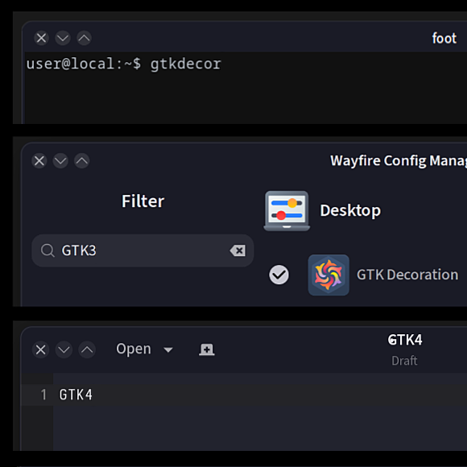

# GTK Decoration Plugin for Wayfire

A  [Wayfire](https://github.com/WayfireWM/wayfire) plugin that provides **server-side window decorations** (SSDs) with native GTK3 theme integration.

## Features

- **Automatic GTK3 Theme Integration**: Decorations automatically match your GTK theme
  - Titlebar colors from your GTK theme
  - Window borders with proper styling
  - Rounded corners (12px top, 8px bottom)

- **Icon Theme Support**: Window control buttons use icons from your icon theme
  - Icons are properly recolored to match theme foreground colors
  - Supports SVG symbolic icons via librsvg
  - Falls back to simple drawn icons if theme icons can't be loaded

- **Font Integration**: Automatically uses your GTK font settings
  - Reads `gtk-font-name` from `~/.config/gtk-3.0/settings.ini`
  - Font size scaled 1.12x to match native GTK titlebar size
  - Centered title text with proper spacing around buttons
  - Long titles truncated with ellipsis to prevent overflow

- **Live Theme Reloading**: Automatically detects and reloads when you change:
  - GTK theme
  - Icon theme
  - Font settings
  - No Wayfire restart required!

- **Configurable**:
  - Button order (left-to-right)
  - Titlebar height
  - Border size
  - Fallback colors and fonts

## Configuration

Add to your `~/.config/wayfire.ini`:

```ini
[core]
plugins = ... gtkdecor ...

[gtkdecor]
# Button order from left to right
button_order = close minimize maximize

# Titlebar and border sizes
title_height = 28
border_size = 4

# Fallback settings (only used if GTK theme can't be loaded)
font = sans-serif
font_color = #ffffffff
active_color = #222222aa
inactive_color = #333333dd

# View matching
ignore_views = none
forced_views = none
```

## Requirements

- Wayfire >= 0.10.1
- Cairo
- Pango
- librsvg 2.0 (optional, for SVG icon theme support)

## How It Works

1. **Theme Loading**: On first render, the plugin:
   - Reads your GTK settings from `~/.config/gtk-3.0/settings.ini`
   - Extracts font family, weight, and size (e.g., "Source Sans 3 Semi-Bold 11")
   - Loads the GTK theme CSS file for colors
   - Font from settings.ini takes priority over CSS to ensure consistent rendering
   - Loads icon theme path

2. **Rendering**: For each window:
   - Titlebar with rounded top corners, bottom corners with subtle rounding
   - Drop shadows on all edges
   - Unified 1px contrast outline around the full decoration
   - Window control buttons with icon theme icons
   - Recolored SVG icons to match theme foreground
   - Title text centered with GTK font (scaled 1.12x for proper size)
   - Long titles automatically truncated with ellipsis
   - Background surfaces cached and reused across frames (only regenerated on resize or focus change)

3. **Live Updates**: Uses inotify to monitor GTK settings file
   - Detects changes to `settings.ini`
   - Automatically reloads all decoration themes
   - Damages windows to trigger re-render

## Comparison with Original `decoration` Plugin

The original `decoration` plugin provides simple static decorations. `gtkdecor` extends this with:

- ✅ Native GTK theme integration (colors, fonts)
- ✅ Icon theme support for buttons
- ✅ Live theme reloading
- ✅ Better visual match with GTK applications
- ✅ Rounded corners
- ✅ Proper icon recoloring

## Development

### Building

```bash
meson setup builddir
ninja -C builddir
```

### Installing

```bash
sudo ninja -C builddir install
```

### File Structure

- `src/decoration.cpp` - Main plugin logic, view matching, inotify monitoring
- `src/deco-theme.cpp/hpp` - Theme parsing, GTK integration, rendering
- `src/deco-layout.cpp/hpp` - Button layout and input handling
- `src/deco-subsurface.cpp/hpp` - Scene graph integration
- `src/deco-button.cpp/hpp` - Button rendering and state management
- `metadata/gtkdecor.xml` - Plugin metadata for Wayfire
- `icons/plugin-gtkdecor.svg` - Plugin icon for WCM

## Credits

Based on the original Wayfire `decoration` plugin, extended with GTK3 theme integration.

## License

Same as Wayfire (MIT)

## Screenshot


## Disclaimer

This project was developed with AI assistance. The code has been analysed with Codacy and Bandit. Use at your own discretion.  
[](https://app.codacy.com/gh/mkay/gtkdecor/dashboard)
